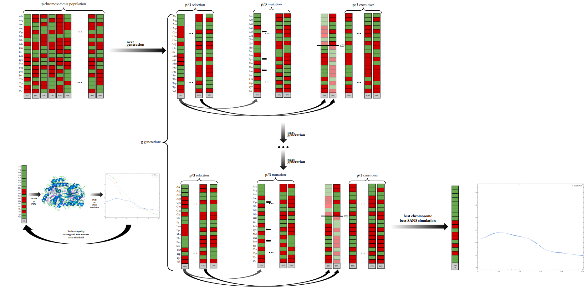
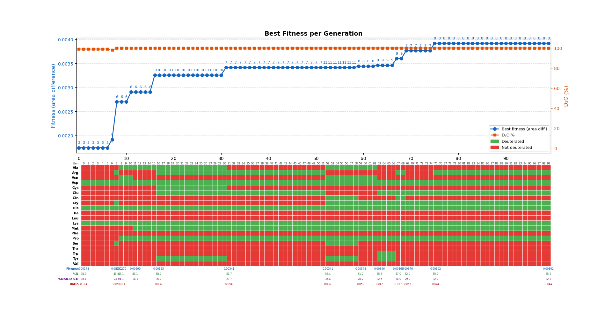
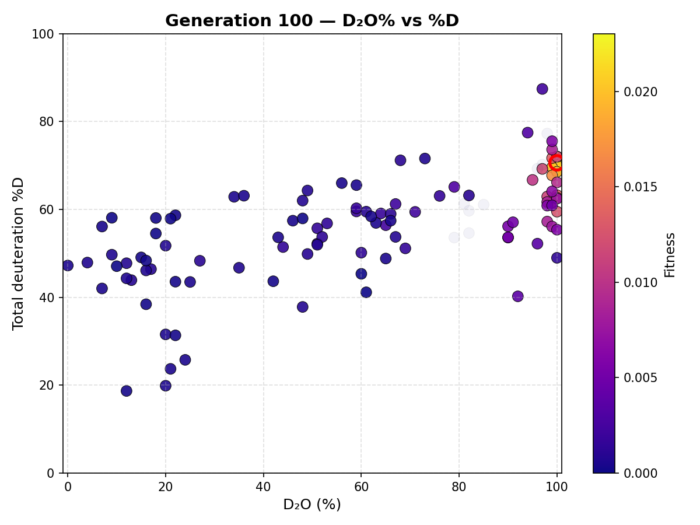

# Deuteration Optimization using Genetic Algorithm for SANS

## Overview

This project implements a genetic algorithm (GA) to find the optimal deuteration pattern of a protein for Small-Angle Neutron Scattering (SANS) contrast variation experiments.

The algorithm evolves a population of chromosomes, each representing:

- Which amino acid types are fully deuterated (non-labile H replaced by D)

- The D2O percentage of the solvent (labile H replaced by D via exchange)

Each chromosome is used to generate a deuterated PDB file, which is then passed to a SANS simulation program (Pepsi-SANS). The fitness of a solution is defined as the product of the areas between the scaled simulated curve and two experimental references (protonated in D2O and protonated in H2O), multiplied by the signal-to-background ratio. A higher fitness score indicates a solution that produces a SANS curve that is simultaneously far from both references, meaning it carries the most contrast information.



The main script `generate_deuterated_pdbs.py` orchestrates the entire workflow, including calling the external simulation script `parallel_process_pdb.sh` which runs Pepsi-SANS in parallel on all generated PDB files.

All components can also be used independently as command-line tools.

---
## Requirements

- `Pepsi-SANS` 3.0 (Linux executable in `./Pepsi-SANS-Linux/Pepsi-SANS`)
- `Python` >= 3.11
- Python packages : 
  - `numpy` >= 2.4.1, < 3
  - `dataclasses` >= 0.8, < 0.9
  - `biopython` >= 1.86, < 2
  - `gemmi` >= 0.7.4, < 0.8
  - `matplotlib` >= 3.10.8, < 4

---

## Installation

This project uses [pixi](https://pixi.sh) to manage all dependencies in a reproducible environment.

**Step 1 — Install pixi**

```bash
curl -fsSL https://pixi.sh/install.sh | sh
```

**Step 2 — Clone the repository**

```bash
git clone https://github.com/HomeroSanchezM/SANS_Deuteration_Paramerer_Optimization.git
cd SANS_Deuteration_Paramerer_Optimization
```

**Step 3 — Enter the pixi environment**

```bash
pixi shell
```

This command reads the `pixi.toml` / `pyproject.toml` file and installs all required packages into an isolated pixi environment automatically. You do not need to manage a virtual environment manually.

Once inside the pixi shell, all scripts can be run directly with `python` or `bash` as shown in the usage sections below.

---

## Usage

### 1. Main script: full genetic algorithm workflow

The central entry point is `generate_deuterated_pdbs.py`. It accepts a non-deuterated PDB file (all hydrogens must be explicit and protonated) and runs the complete pipeline: population initialization, PDB generation, Pepsi-SANS simulation, fitness evaluation, and iterative evolution.

**Using command-line arguments directly:**

```bash
python generate_deuterated_pdbs.py <input.pdb> [options]
```

Common options:

| Option | Description |
|:-----------|:-----------|
| `-p, --population_size` | Population size (must be a multiple of 3) |
| `-e, --elitism` | Number of elite individuals preserved (must be <= population_size / 3) |
| `-v, --d2o_variation_rate` | Maximum D2O change per mutation (range 0-100) |
| `-g, --generations` | Number of generations to run |
| `--seed` | Random seed for reproducibility |
| `--output_dir` | Output folder (default: `<pdb_basename>_deuterated_pdbs`) |
| `--batch_script` | Path to the parallel batch processing script (default: `./parallel_process_pdb.sh`) |
| `--q-max` | Maximum q value for fitness evaluation in inverse angstroms (default: 0.3) |
| `--ratio-threshold` | Minimum Imax/background ratio to accept a curve (default: 0.01) |
| `--d2o` | Lock D2O to a fixed list of values, e.g. `--d2o 0 42 100` |

Example:

```bash
python generate_deuterated_pdbs.py myprotein.pdb -p 30 -e 3 -g 10 --seed 42
```

**Using a configuration file:**

All parameters can be set in `config.ini` instead of being passed on the command line. CLI arguments always override the config file when both are provided.

```bash
python generate_deuterated_pdbs.py myprotein.pdb --config config.ini
```

See the `config.ini` section below for the full list of supported parameters.

---

### 2. Running multiple simulations across proteins: convergence study

The script `run_convergence_simulation_multiprotein.sh` automates running the genetic algorithm multiple times for one or more proteins, each with a fixed set of random seeds.

```bash
bash run_convergence_simulation_multiprotein.sh protein1 [protein2 ...]
```

For each protein name provided, the script expects a corresponding PDB file at `original/<protein>.pdb`. It then runs the GA once per seed (by default seeds 42, 1 through 9), saving results under `result_<protein>/convergence_simulation/seed_<seed>/`. After each run it automatically generates the fitness evolution plot and the D2O vs %D scatter plots.

The fixed parameters (population size, number of generations, elitism, D2O variation, ratio threshold) are set at the top of the script and can be edited there.

Example:

```bash
bash run_convergence_simulation_multiprotein.sh gfp mbp
```

This will run 10 simulations for GFP and 10 for MBP, one per seed.

---

### 3. Standalone PDB deuteration

Deuterate a single PDB file according to a specification, without running the full genetic algorithm.

```bash
python pdb_deuteration.py [config.ini] [options]
```

Examples:

```bash
# Command line
python pdb_deuteration.py -i input.pdb -o output.pdb --d2o 50 --ALA --GLY

# Using a config file
python pdb_deuteration.py pdb_config.ini
```

Flags for each amino acid (`--ALA`, `--GLY`, etc.) activate deuteration of that residue type. Use `--all` to deuterate all amino acids. Use `--no-ALA` etc. to exclude a specific type when combined with `--all`.

---

### 4. Standalone fitness evaluation

Evaluate the fitness of existing `.dat` simulation files against reference curves, without running the GA or Pepsi-SANS again.

```bash
python fitness_evaluation.py <directory> [options]
```

The directory must contain `.dat` files and a `ref/` subfolder with the two reference curves. The script outputs raw fitness scores (one per line) and a summary.

Options:

| Option | Description |
|:--------|:--------|
| `--q-max` | q truncation limit in inverse angstroms (default: 0.3) |
| `--ratio-threshold` | Minimum Imax/background ratio to accept a curve (default: 0.01) |
| `--deut-ref` | Custom reference filename for the deuterated curve inside `ref/` |
| `--prot-ref` | Custom reference filename for the protonated curve inside `ref/` |

---

## Configuration files

### `config.ini`: genetic algorithm and fitness parameters

Used by `generate_deuterated_pdbs.py`:

- `[POPULATION]`: `population_size`, `elitism`, `d2o_variation_rate`
- `[GENETIC]`: `mutation_rate`, `crossover_rate`
- `[EXECUTION]`: `generations`, `seed`
- `[RESTRICTIONS]`: which amino acid types the GA is allowed to modify (20 boolean entries)
- `[FITNESS]`: `q_max`, `ratio_threshold`, `deut_ref`, `prot_ref`
- `[D2O]`: optional fixed D2O list (space-separated integers, e.g. `d2o = 0 42 100`); set to `None` to use free variation

Command-line arguments always override values in the config file.

### `pdb_config.ini`: standalone PDB deuteration

Used by `pdb_deuteration.py`:

- `[DEUTERATION]`: `input_pdb`, `output_pdb`, `d2o_percent`
- `[AMINO_ACIDS]`: which amino acid types are deuterated (20 boolean entries)

---

## Visualization

### Fitness evolution plot

The script `plot_fitness_evolution.py` reads `best_fitness_summary.csv` and generates a figure showing the best fitness and D2O percentage of the best chromosome at each generation. With the `--annotate` flag, a colour grid is added below the plot showing which amino acids were deuterated in the best solution at each generation.

```bash
python plot_fitness_evolution.py best_fitness_summary.csv --annotate --min -o fitness_plot.png
```



### D2O percentage vs total deuteration scatter plot

The script `d2o_vs_d.py` reads generation summary files and generates one scatter plot per generation, showing each chromosome's D2O percentage on the x-axis and its total deuteration percentage (%D) on the y-axis. Points are coloured by fitness using the plasma colormap, and the best individual is highlighted with a red circle.

```bash
python d2o_vs_d.py <output_dir>
```



---

## Notes

- The input PDB file must have all hydrogen atoms explicit and fully protonated before running the tool. Use tools such as PDBFixer or GROMACS to add missing hydrogens if needed.
- The two reference curves (protonated protein in D2O solvent and protonated protein in H2O solvent) are generated automatically by the main script and placed in the `ref/` subfolder.
- Pepsi-SANS must be available at the path `./Pepsi-SANS-Linux/Pepsi-SANS` relative to where the scripts are run.
- GNU `parallel` must be installed for `parallel_process_pdb.sh` to work. It is included as a pixi dependency.
